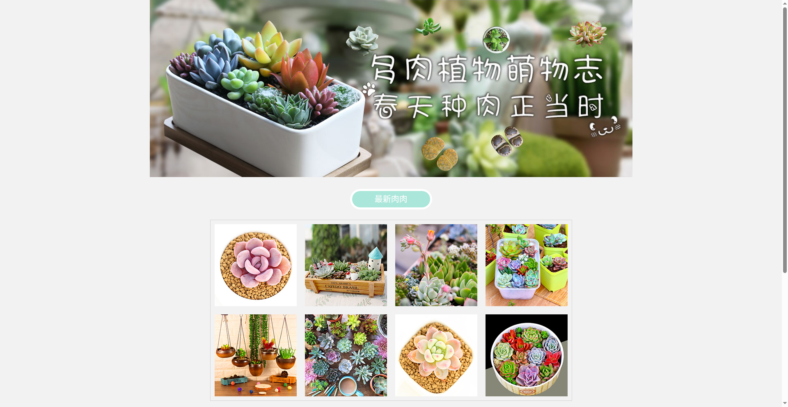

# Plant Mall

A responsive single-page website for a plant shop, built with HTML and CSS. It presents the shop's plants and products with a clean, mobile-friendly layout.

## Preview

## Tech Stack

- HTML5
- CSS3 (responsive layout with media queries)

## Features

- Responsive design that adapts to desktop and mobile screens
- Product showcase with images
- Simple, clean single-page layout

## How to Run

No build step needed — it's a static site:

1. Clone or download this repository.
2. Open `Plant Mall/Plant Mall.html` in any modern browser.

## Live Demo

👉 [Live Demo](https://iancai119.github.io/plant-mall/Plant%20Mall/Plant%20Mall.html)
